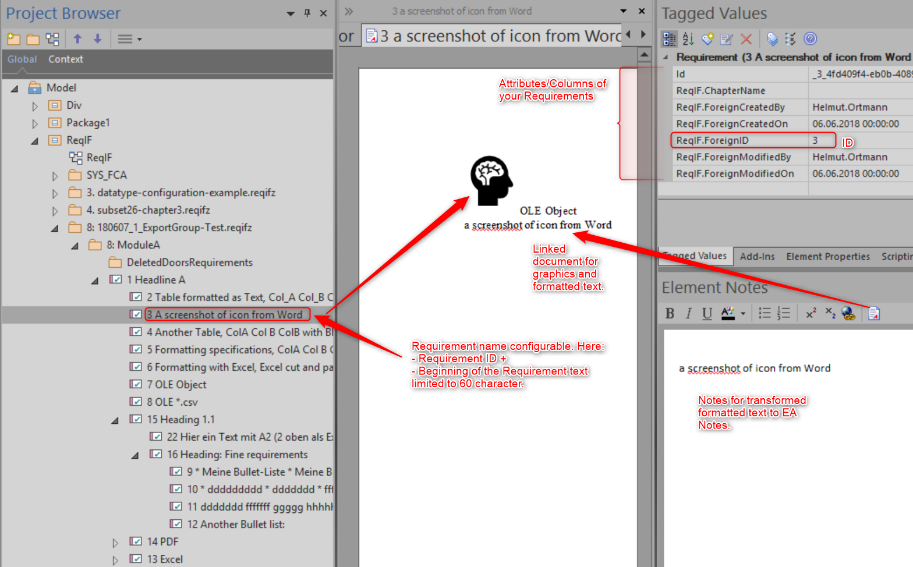
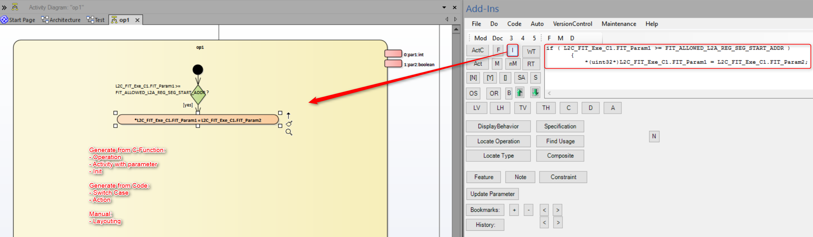

# hoReverse 

*  Requirements / ReqIF
   *  [Import/Export](https://github.com/Helmut-Ortmann/EnterpriseArchitect_hoReverse/wiki/ImportExport) [ReqIF](https://github.com/Helmut-Ortmann/EnterpriseArchitect_hoReverse/wiki/ReqIF), [Doors CSV](https://github.com/Helmut-Ortmann/EnterpriseArchitect_hoReverse/wiki/ImportDoorsCsv), [Structures xml](https://github.com/Helmut-Ortmann/EnterpriseArchitect_hoReverse/wiki/ImportStructuredXml)
   *  [ReqIF Roundtrip](https://github.com/Helmut-Ortmann/EnterpriseArchitect_hoReverse/wiki/ReqIF_Roundtrip)
   *  [ReqIF Export](https://github.com/Helmut-Ortmann/EnterpriseArchitect_hoReverse/wiki/ReqIF_Export) ([ReqIF](https://github.com/Helmut-Ortmann/EnterpriseArchitect_hoReverse/wiki/ReqIF), [ReqIF Roundtrip](https://github.com/Helmut-Ortmann/EnterpriseArchitect_hoReverse/wiki/ReqIF_Roundtrip))
*  Development
   *  [Reverse Engineer C/C++ Code](#the-roots)
   *  [Features to improve everyday life](#the-roots)
*  [Import](ImportExport) ([ReqIF](ReqIF), [ReqIF Roundtrip](ReqIF_Roundtrip), [ReqIF Export](ReqIF_Export)[Doors CSV](ImportDoorsCsv), [Structures xml](ImportStructuredXml))
*  [Reverse Engineer C/C++ Code](#the-roots)
*  [Features to improve everyday life](#the-roots)

## The roots

hoReverse is a workbench to ease reverse Engineering of C/C++ into EA (Enterprise Architect). It helps you make a model out of existing C/C++ code. The major focus is to make Activity Diagrams of code and link it to static architecture.

In essence, it helps you to produce a Functional Safety compliant detailed design on the basic of Activity Diagrams, Classes, Interfaces with Operations and Attributes. All the model elements are linked together to make maintainable models.

Because in embedded I like the concept of Ports there are a lot of features to boost the work.

For details see the [WiKi](https://github.com/Helmut-Ortmann/EnterpriseArchitect_hoReverse/wiki).

### ReqIF

ReqIF is the standard to exchange Requirements between different tools. hoReverse now supports:

-  [ReqIF](https://github.com/Helmut-Ortmann/EnterpriseArchitect_hoReverse/wiki/ReqIf)
-  [ReqIF roundtrip/workflow](https://github.com/Helmut-Ortmann/EnterpriseArchitect_hoReverse/wiki/ReqIF_Roundtrip)

## History

In a lot of embedded C/C++ projects with EA I missed functionality to create and maintain:

- Architecture
- Detailed Design from Code
- Activity Diagrams to model module behaviour
- [Import Requirements and tests](ImportExport)

Especially the requirements of safety (ASIL D or SIL 3) projects forced my to do dull work with a lot of errors and frustrating reviews or to find something to make it run more smoothly.

That was the start of hoReverse. By the time it grows and in current projects I'm able to make a decent detailed design from Code with not too much manual work. 

Is this all according to theory or the processes? Can''

Let's discuss it, but it works.

## Functions

- A lot of [hoTools](https://github.com/Helmut-Ortmann/EnterpriseArchitect_hoTools/wiki) functionality
- Make Activity diagrams from code
- Link static design and behavior together
- Extensible

## News

3.1.6 ReqIF error handling improved
- Define which ReqIF is available for Import, Export, Roundtrip ("AllowedOperations": "Import,Export") 
- Error fix: No Tagged Value defined
- Export ReqIF now supports EA local path

3.1.5 Fix Error EA Tagged Values with Blank in Enum Values (ReqIF)
-  Export Example added

3.1.4 Sautin converter instead of MariGold for import (easily to change back), Error fixing
-  Sautin converter instead of MariGold for import (looks as if better converting results XHTML to DOCX/rtf)
-  Error fixing ReqIF from EA Notes
-  Updated NuGetPackages (MariGold, SQLITE)
-  Do Import/Export only with possible configuration

3.1.3 [ReqIF Export](ReqIF_Export), Error fixing
-  hoReverse converts EA 'Linked Documents' to ReqIF XHTML format
   Make sure the recipient can understand the format.
   See Linked Document in:
   https://github.com/Helmut-Ortmann/EnterpriseArchitect_hoReverse/wiki/ReqIF_Export#features
-  Error message if "ReqIF/Import specification" is missing in Settings.json
-  Integrated developer license for sautinSoft RtfToHtml (www.sautinsoft.com)

3.1.2 ReqIF Eport from EA
-  Fix error nested AddinQuery (Elements without Tagged Values)
-  linq2db 2.2.0

3.1.1 Add-In Search with LINQ to SQL (rearly fast for recursive search)

3.1 ReqIF import with Links between Requirements
-  Add-In Search/Show for [nested elements/requirements](https://github.com/Helmut-Ortmann/EnterpriseArchitect_hoTools/wiki/ShowNestedElements)
-  [Service](https://github.com/Helmut-Ortmann/EnterpriseArchitect_hoTools/wiki/Services) to Search/Show nested elements/requirements

3.0.5  
- Support of *.eapx files
- Fix copy name to clipboard for empty name

3.0.4 Import preserves roundtrip values
- error fixing

3.0.3 Enum with multivalue selection support
- TaggedValue name optional with prefix (per ReqIF module)

3.0.2 Roundtrip/Workflow ReqIF
-  Define columns for [roundtrip](https://github.com/Helmut-Ortmann/EnterpriseArchitect_hoReverse/wiki/ReqIF_Roundtrip)
-  Supported types: string, xhtml, enum

3.0.1 ReqIF *.pdf, *.wmf files supported
-  Files are stored in the File Section of Requirements
-  error fixing and minor improvements

3. [Import Requirements](https://github.com/Helmut-Ortmann/EnterpriseArchitect_hoReverse/wiki/ReqIf), Tests (Doors, *.ReqIf, *.reqIfz, *.csv, *.xml)
-  Import requirements into EA Package (ReqIF, DOORS ReqIf, DOORS *.csv, structured *.xml)
-  Bug fixing 

2.1.10 Error fixing
-  Create CallBehaviour Action with SQL error fixed
-  Service Copy ID of Element, Package, Diagram, .. copied
-  Improved update behavior create/update activity from Method
-  Exception add note to diagram added 

2.1.9  Error fixing
- No Error message if Settings.Json doesn't contain configuration chapter for Styles, Bulk changes and more
  - Menu entry shows the information of missing configuration

2.1.8 Choose CallBehavior Action or CallOperation Action for a C/C++ function call
- Entry field allows Enter without starting a query. Start the query with Buttons or use hoTools

2.1.7 Bulk change Elements (Diagram, Browser, Package, Package recursive) 
- Bulk change Elements (Diagram, Browser, Package, Package recursive)
- Search: <Search Term> in hoReverse Entry field 

2.1.6  Bulk Change Diagram elements
-  Bulk change Diagram elements (Stereotype, Tagged Values)
-- Configuration in %appdata%roaming\ho\hoReverse\settings.json
- Error fixes
-- - Fixes (e.g.Features, Constraint, Note)

2.1.5 Installaller can handle no admin install for user install
- Create/Update activity (fix skipped parameter)
- Install without Admin rights (per user install)
-- Click on *.msi
-- Advanced!!!
-- Use default: Install just for you!!!

2.1.3 Bug fixing, documentation, installation
- Copy selected Elements to Clipboard and order them
- Integrate LINQ for SQLite
- Handle VC Code Symbol DB
- 
2.1.1 Sort Ports optimized

## FAQ

### Does everything run automatically

No, it's a workbench which helps you. It releases you from a lot of boring work. Instead, you have to think how:

- to best visualize things
- to hide complexity without ignoring them
- Bind static architecture to detailed design

In essence, in my view, the interesting part of reverse engineering.

### Do I get an ASIL D or SIL 3 compliant detailed design?

hoReverse helps you. Usually, I have no greate issues with reviews or assessments. But to be honest, hoReverse only helps in transforming code into Activity Diagrams. Making sense in Activity Diagrams is your responsibility.

### Can I change or enhance functionality?

Of course, it's open source under the MIT license. You can participate in this project or do your work.

### Do you have a method?

hoReverse doesn't stick to any plan. It's just a workbench with different tools I found useful. But of course, I have a clear view of the architecture of System and Software.

### Is it SPICE compliant?

It's your work to make it SPICE compatible. In the past, I had no issue with that.

### Is it ISO 26262, IEC 61508, Functional Safety compliant?

It's your work to make it compliant. In the past, I had no issue with that.

### What are the technical basics of hoReverse?

- .net with C#
- EA Add-In
- VS2017
- And a lot of open source software 

### What do you think of AUTOSAR?

I like the concepts of AUTOSAR. Usually, I model Modules, Runnables, Ports the way AUTOSAR does it. hoReverse has no special AUTOSAR functionality but helps you with a lot of small helpers for everyday tasks.

